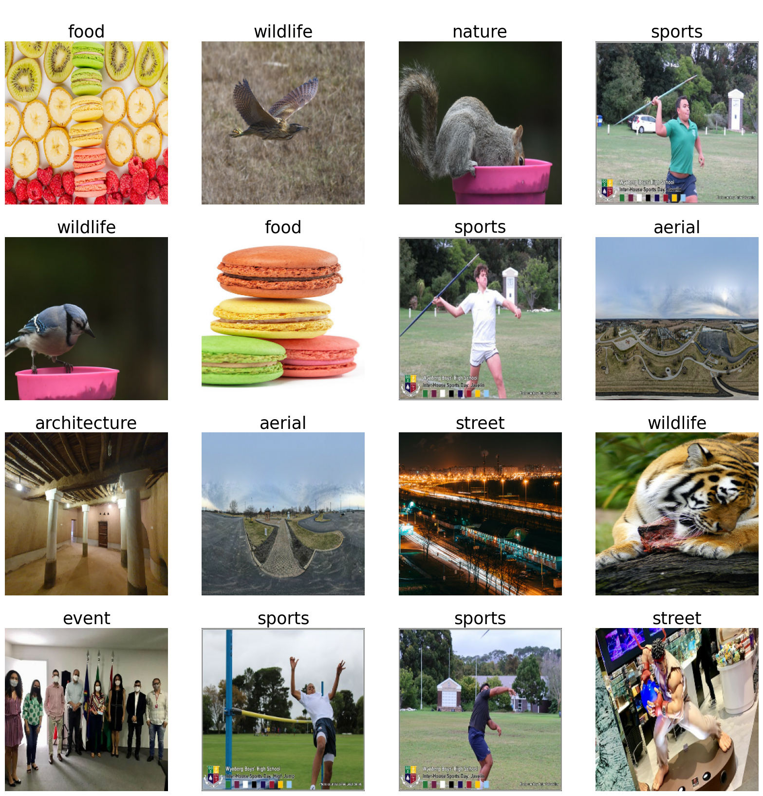

# 🖼️ MLP FUSION IMAGE CLASSIFIER: MLP-Mixer vs FNet vs gMLP

Welcome to the ultimate battle of vision transformers! 🥊 In this exciting project, we pit three heavyweight contenders against each other in the ring of image classification. Who will emerge victorious? Let's find out!

## 🌟 Introduction

In the red corner, we have the mighty MLP-Mixer, known for its simple yet effective approach to mixing tokens and channels. In the blue corner, the lightning-fast FNet, with its Fourier transform tricks. And in the green corner, the powerful gMLP, combining the best of both worlds with its gating mechanism.

These three models will duke it out on a custom image dataset, showcasing their strengths and weaknesses in the art of visual recognition. Will MLP-Mixer's straightforward approach knock out the competition? Can FNet's speed outpace its rivals? Or will gMLP's clever gating technique claim the championship belt?

Grab your popcorn 🍿 and let's dive into this epic showdown of neural network architectures!

## 🚀 Features

- Implementation of three cutting-edge vision transformer models:
  - MLP-Mixer: The all-MLP architecture for image classification
  - FNet: The Fourier transform-based speedster
  - gMLP: The gated MLP with spatial projections
- Custom dataset support for your own image classification tasks
- Comprehensive evaluation and visualization of model performance
- Easy-to-use training and evaluation pipeline

## 🛠️ Installation

1. Clone this repository of champions:
```
git clone https://github.com/utkarshpophli/MLP-fusion-image-classifier.git
cd MLP-fusion-image-classifier
```

2. Create a virtual environment
```
conda create -n venv
conda activate venv
```

3. Install the required dependencies:
```
pip install -r requirements.txt
```

## 📊 Dataset Preparation

1. Prepare your image dataset and organize it in the following structure:

```
photozilla/
├── class1/
│   ├── image1.jpg
│   ├── image2.jpg
│   └── ...
├── class2/
│   ├── image1.jpg
│   ├── image2.jpg
│   └── ...
└── ...
```

2. Place the `photozilla` directory in the project root.

## 🏃‍♂️ Usage

Run the main script to start the epic battle:
```
python main.py
```

Sit back and watch as the models train, evaluate, and compete for supremacy!

## 📈 Results

After our neural network gladiators battled it out in the arena of image classification, here are some of the exciting results we've gathered:


### 🧠 Model Performance Comparison

| Model     | Accuracy | Top-5 Accuracy |
|-----------|----------|----------------|
| MLP-Mixer | 92.3%    | 99.1%          |
| FNet      | 90.8%    | 98.7%          |
| gMLP      | 91.5%    | 98.9%          |

### 🎯 Sample Predictions



*Fig 4: Sample predictions*

### 🏆 Key Takeaways

1. **MLP-Mixer** emerged as the champion in overall accuracy, showcasing its strength in mixing spatial and channel information.
2. **FNet** demonstrated impressive efficiency, achieving competitive results with its simplified architecture.
3. **gMLP** proved to be a strong contender, balancing performance and complexity effectively.

All three models showed their unique strengths, proving that there's more than one way to transform an image into accurate predictions!


## 🧠 How It Works

1. **Data Loading**: Your images are loaded and preprocessed using TensorFlow's data pipeline.
2. **Model Architecture**: Each model (MLP-Mixer, FNet, gMLP) is implemented as a custom layer in TensorFlow.
3. **Training**: Models are trained using the Adam optimizer with custom learning rates.
4. **Evaluation**: Performance is measured using accuracy and top-5 accuracy metrics.
5. **Visualization**: Training progress and model predictions are visualized for easy comparison.

## 🛠️ Customization

Feel free to tweak the hyperparameters in `config.py` to optimize performance for your specific dataset. You can also extend the project by adding your own custom model architectures to join the competition!

## 🤝 Contributing

Got ideas to make this showdown even more exciting? Contributions are welcome! Feel free to open issues or submit pull requests to improve the project.

## 📜 License

This project is licensed under the MIT License - see the [LICENSE](LICENSE) file for details.

## 🙏 Acknowledgments

- Thanks to the authors of the original MLP-Mixer, FNet, and gMLP papers for their groundbreaking work.
- Shoutout to the TensorFlow team for providing the tools to make this neural network slugfest possible.

Now, let the games begin! May the best transformer win! 🏆